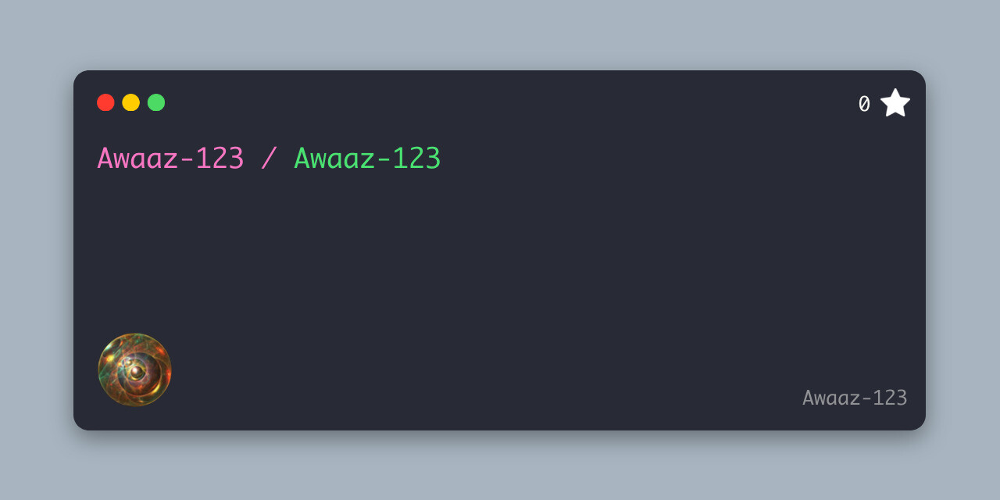

  

 

  <h2>Data Structure</h2> 

 

### 👨‍💻 About Me

* 🔭 I’m currently working on **[Insert your current project here]**.
* 🌱 I’m currently learning **[Insert what you are studying/learning]**.
* 👯 I’m looking to collaborate on **[Insert project types you want to join]**.
* ⚡ Fun fact: **[Insert a cool fact about yourself!]**

 

### 🛠 Tech Stack

| Category | Technologies |
| :--- | :--- |
| **Languages** |    |
| **Frontend** |    |
| **Backend & DB** |    |
| **Tools** |    |
